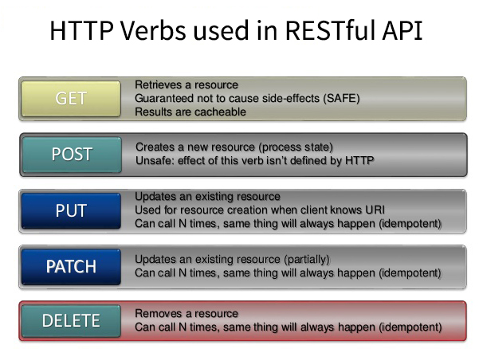

# Web API Interview Questions
[source](https://www.youtube.com/watch?v=FySr1tusL8c&ab_channel=InterviewHappy)

--- --- 

## Questions

- What is web api (application programming interface)? what is its puprpose (provides interaction b/w software applications)?
- What are API advantages over web services and WCF (web services acts as intermediatry b/w database and UI)?
- Web APIs works using http(VERBS), open source, it is lightweight(good for small decies such as mobiles), controller is similar to MVC controller(easy to understand and maintain).
- What is REST and RESTful API? (REST is set of principles to create software that can easily communicate, and RESTful API are APIS ones built using REST principles)
- What are REST guidelines?
  1. separartion of client and server: client side and server side (bussiness logic and data layer) can be implemented and built independently.
  2. server will not store anything related to latest http request made, it will treat every request as new. Meaning it is stateless
  3. uniform interface: identify resources by URL, 
  4. Cacheable: The cacheable constraint requires that a response should implicitly or explicitly label itself as cacheable or non-cacheable.
  5. Layered System: The layered system style allows an architecture to be composed of hierarchical layers by constraining component behavior. In a layered system, each component cannot see beyond the immediate layer they are interacting with.

- Can we build RESTFUL services with WCF? (yes)
- What are HTTP VERBS or HTTP methods? ()

- How to consumer WEB API in Project? (In MVC project using consumer using HttpClient, in JS use axios or fetch, in Angular use HttpClient)
- What is the difference b/w WEB API controller and MVC Controller?
- What is API Key authentication in Web API? (user will be provided key to access api resources)
- What is token based authentication?(4 step process, send credentials, validate them and send token as response, for subsequent requests use the token, token is expired after certain time)
- OAuth is standard for token based authentication?
- What is JWT authentication? (json web token based authentication. Most common, it has three parts: header, payload and signature)
- Where JWT token resides? (In the request header: {"Key": "Authorization", "Value": token-value})

--- ---

## Advanced Topics

- How to test web api? (use postman and swagger)
- main return types in web api (void, HttpResponseMessage, ActionResult, Custom types)
- Difference b/w IHttpResponseMessage and IActionResult? (IActionResult is replacement for IHttpResponseMessage)
- What is content navigation in web api? (client asks the data in particular format such as JSON, XML and api sends it in that format. It is also called content navigation)
- MediaTypeFormatter in Web API? (JSONMediaTypeFormatter, XmlMediaTypeFormatter)

--- ---